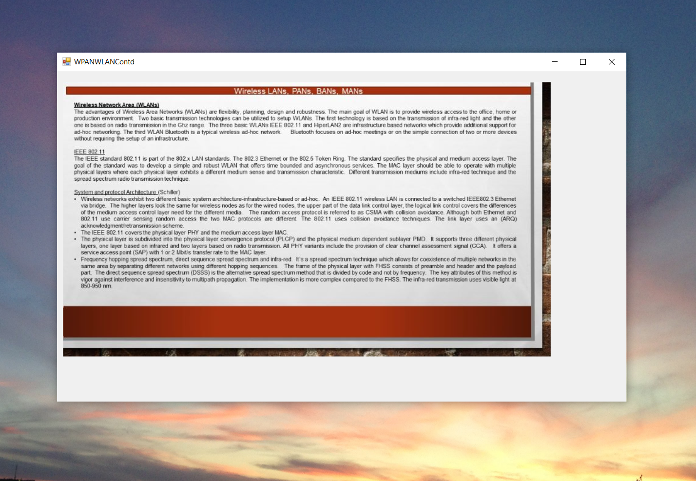

# Wireless and Mobile Systems

The project provides an introduction to the Wireless and Mobile Systems

Confidential information is not displayed.

Please download the executable in https://github.com/alpaddesai/WirelessandMobileSystems/releases for details.

Images are custom.

## Wirelss and Mobile Systems

## Introduction

## Probability

## Channel coding error

## Channel coding error contd

## Cellular Concept

## Multiple Radio Access

## Multiple Division Technology

## Mobile Communication Systems

## Modulation Techniques

## Channel Allocation 

## Network Protocols

## Network Protocols contd

## Encryption and Decryption Techniques

## WLAN and WPAN

## WLAN and WPAN contd

## Recent Advances

## Sensor Networks
### MS word

## Network Simulator

